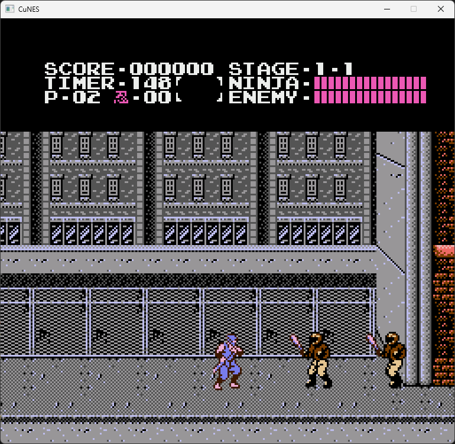

# CuNES

CuNES is a work-in-progress NES emulator written in C# with a Raylib frontend.  
It currently supports loading `.nes` ROMs, rendering video, handling controller input, and generating APU audio (funky but working).

## Download Release

Download the latest Windows release from [here](https://github.com/Ganta09/CuNES---CSharp-Nes-Emulator/releases).

## Current Features

- CPU/PPU/APU emulation core in C#
- ROM loading at startup (`--rom`) or in-game via menu
- In-game context menu (right click while playing)
- Runtime key remapping from the UI (`Key Binds`)

## Controls

- In-game menu: **right click**
- Menu actions: `Load ROM`, `Close ROM`, `Key Binds`, `Exit`
- Default Player 1 bindings:
  - A: `Z`
  - B: `X`
  - Select: `Right Shift`
  - Start: `Enter`
  - D-Pad: Arrow keys

## Build and Run

```bash
dotnet build CuNES.sln
dotnet run --project CuNES.csproj -- --rom path/to/game.nes
```

## Quick file tour 

- `Program.cs`: CLI args parsing and app bootstrap.
- `Core/NesApp.cs`: Main runtime loop, renderer integration, ROM/test flow.
- `Core/NesConsole.cs`: Wires CPU, PPU, Bus, and cartridge lifecycle.
- `Cpu/Cpu6502.cs`: 6502 implementation and instruction execution.
- `Ppu/Ppu2C02.cs`: PPU rendering, timing, VRAM/palette behavior.
- `Core/Apu2A03.cs`: APU channels, mixer, and debug snapshots.
- `Bus/SystemBus.cs`: CPU memory map, I/O, controller and APU register routing.
- `Cartridge/Cartridge.cs`: iNES parsing and mapper selection.
- `Frontend/RaylibRenderer.cs`: Window/audio output, input, context menu, key bind UI.
- `Frontend/NullRenderer.cs`: Non-interactive fallback renderer.
- `Tests/CpuSelfTests.cs`: Basic CPU self-test harness.

## Not Done Yet / Known Issues

- Unofficial 6502 opcodes are not fully implemented yet.
- Noise channel behavior is still a bit funky and needs tuning.
- Accuracy still needs more validation against hardware behavior and test ROM suites.

## Features to add

- Savestates
- Resize Window

## Screenshots / Images

<p align="center">
  
</p>


## Acknowledgements

Special thanks to these references:

- NESDEV Wiki: https://www.nesdev.org/wiki/Nesdev_Wiki
- 6502 Opcodes: https://www.masswerk.at/6502/6502_instruction_set.html
